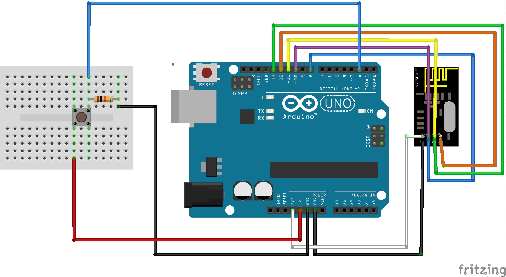

This code allows an Arduino UNO to control MiLights via an nRF24L01.

For the communication the openmili library by henryk is used: https://github.com/henryk/openmili

## Functions
All the functions are documented inline. Functions are:
```
setColor(uint8_t red, uint8_t green, uint8_t blue);
setBrightness(uint8_t percentage)
sendSync(uint8_t group)
```

To be compatible with your remote, make sure to use the same ID. Replace the first three bytes (B0, 2C, 8C).

```
static uint8_t message_t[] = {0xB0, 0x2C, 0x8C, 0x00, 0xB9, 0, 0xDD};
```

This project is build with platformio but you should be able to backport it to pure Arduino.

## Wiring

